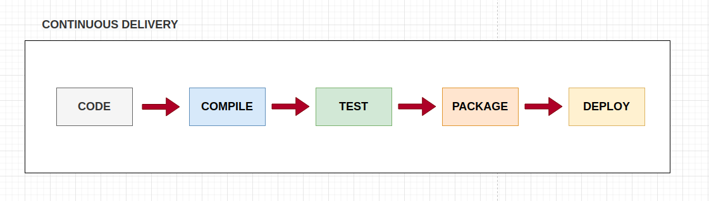

<H1>Minedu Microservices and Pipeline starter code/Infraestructure for Python, Java and nodeJS Technologies</H1>

<H2>Microservices</H2>

Each microservice detail execution /dependencies are in the READMEs in:

1. [`./ms-minedu-java/`](./ms-minedu-java/README.md)
2. [`./ms-minedu-python/`](./ms-minedu-python/README.md)
3. [`./ms-minedu-nodejs/`](./ms-minedu-nodejs/README.md)

<H2>Continuous Delivery</H2>

Automating the preparation of code for release.

There's a constant desire in the software development community defining processes that will make deploying code more efficient reliable. 

Pushing features to clients faster means:
<ol> 
  <li>Faster feedback</li> 
  <li>Faster design iteration</li>
</ol>

Continuous delivery is a software deployment practice which tries to accomplish this by automatically preparing code for release to production.

Continous delivery systems include:

<ol> 
  <li>Automatic code compilation</li> 
  <li>Automatic running tests</li>
  <li>Automating the packaging of code</li>
  <li>Deployment</li>
</ol>

The stages can vary depending on the environment where the pipeline is executed. Often the systems have:
<ul>
  <li>Local environment</li>
  <li>Development environment</li>
  <li>QA environment</li>
  <li>Pre Production environment</li>
  <li>Production Environment</li>
</ul>

Some of them can be avoided depending on the development/infrastructure teams. The most often trilogy are Development/QA/Production environments.

By automating most or all of the build test and deployment process, you can deploy more often and with less effort. This enabled more frequent releases and faster customer feedback opportunities.

