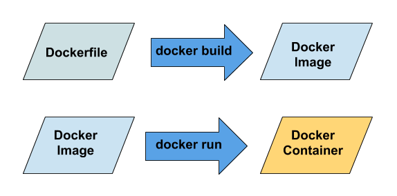

<h1>Dockerfiles</h1>

```
FROM python:3.7.2-slim

COPY . /app
WORKDIR /app

RUN pip install --upgrade pip
RUN pip install flask

ENTRYPOINT ["python", "app.py"]
```

<h1>Process of running a container starting from Dockerfile</h1>


